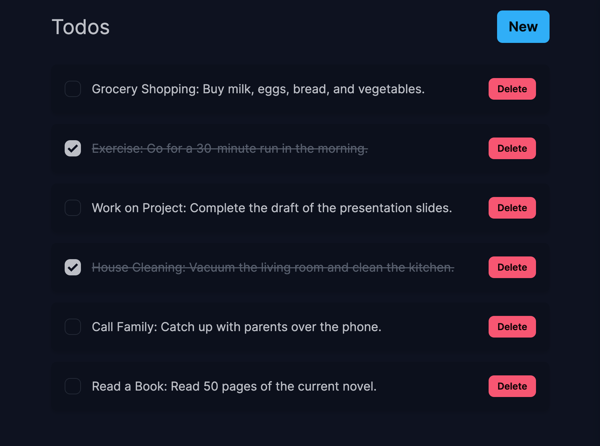

### Simple Todo App with Next.js, TypeScript, Prisma, and DaisyUI

This is a basic Todo application that I developed using **Next.js**, **TypeScript**, **Prisma**, and **DaisyUI**. The primary goal of this project was to practice and deepen my understanding of Next.js, particularly the differences and interactions between client and server components.

**Key Features:**

- **Next.js**: Utilizes the latest features of Next.js for server-side rendering and static site generation.
- **TypeScript**: Implements strong typing to improve code quality and maintainability.
- **Prisma**: Leverages Prisma as an ORM to interact with the database efficiently.
- **DaisyUI**: Uses DaisyUI for styling, providing a beautiful and consistent user interface with minimal effort.

This project serves as a practical exercise in modern web development, focusing on:

- **Client vs. Server Components**: Understanding how to effectively use client and server components within Next.js.
- **Data Fetching**: Implementing data fetching strategies to ensure fresh data is displayed.
- **State Management**: Managing state and handling CRUD operations within a React application.
- **UI Design**: Utilizing DaisyUI to create a visually appealing and user-friendly interface.

Feel free to explore the code and experiment with the functionalities. This project is a stepping stone for more complex applications and aims to solidify fundamental concepts in full-stack development.

